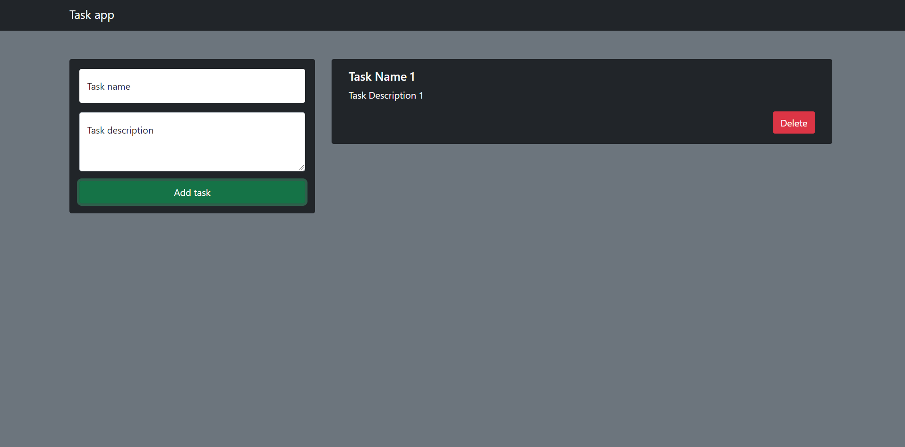

# Tasks-List

## Instalacion

-Este proyecto no requiere la instalacion de ningun programa extra.
## Introduccion

-En este proyecto encontraremos un programa el cual nos permite agregar y quitar tareas a forma de TODO.
-Este programa hace uso del localStorage perteneciente al navegador, es decir que los datos que ingresemos a este programa, a diferencia de el uso de sessionStorage, este no eliminar sus datos al cerrar la pagina.
## Screenshots

